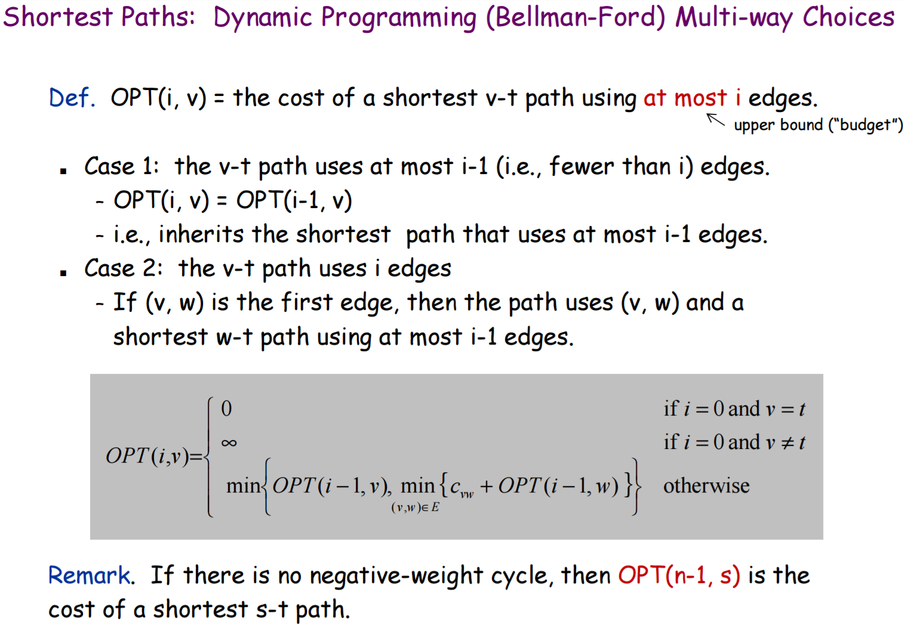
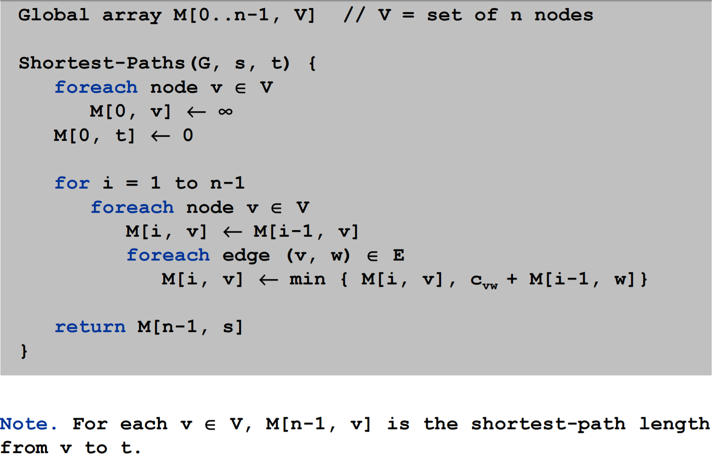
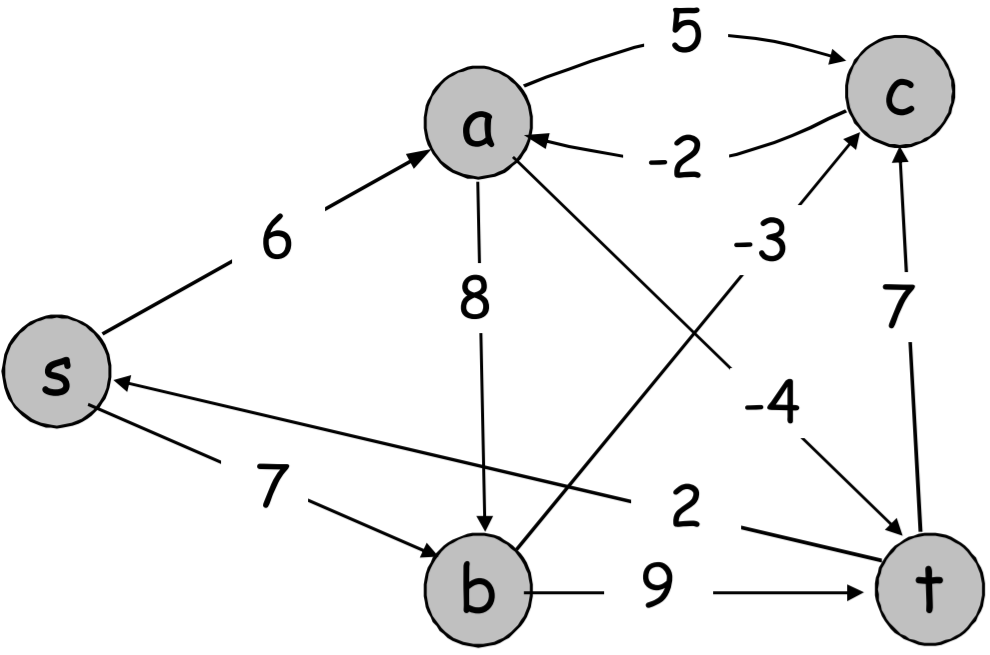
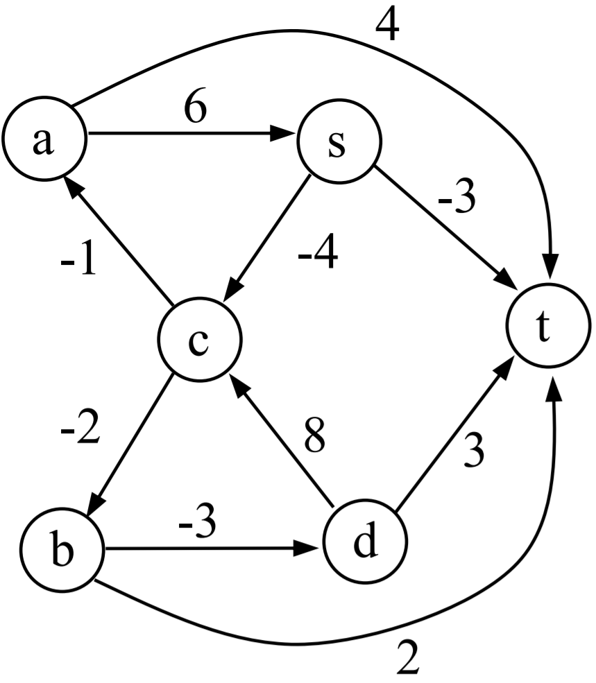
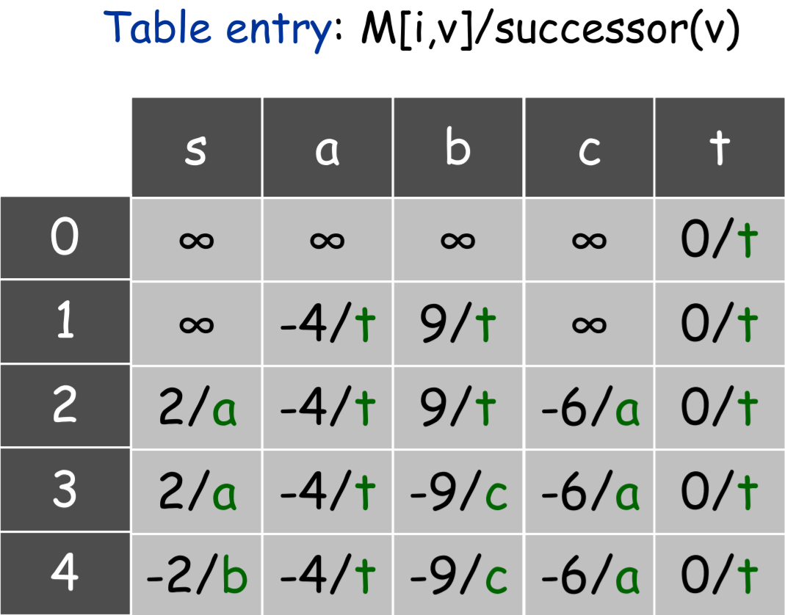

# Bellman Ford (Shortest Paths with Negative Weights)
Dynamic programming algorithm to find the shortest paths from every vertex to the goal vertex. Edges can have negative weights, but no negative-weight cycles (otherwise you could keep looping over a negative-weight cycle to get an infinitely negative number & shortest path would have no meaning). Dijkstra's fails for negative-wiehgt edges but Bellman-Ford can do it.

## Optimal Substructure
  
The shortest path between any 2 vertices uses at most **n-1** edges (**n**=number of vertices). Since there cannot be any negative-weight cycles, any more than **n-1** edges would only add to the total path cost so the algorithm stops when **n-1** edges have been considered.  
Bellman-Ford considers the shortest paths in increasing order of **number of edges used** starting from 0 edges (hence infinity for all but the goal node), then shortest paths using 1 edge, up to **n-1** edges.

## Pseudocode

## Input Graphs
### Graph 1

### Graph 2

## Usage
- `int[][][] graph` is an **adjacency list** for a weighted, directed graph
  - `graph[0]` contains all edges **FROM** vertex `0`
  - Each `graph[0][v]` is an edge as a 2D array containing `[destinationVertex, edgeWeight]`
  - So for **Graph 1**, `graph[0]` is `{ {1, 6}, {2, 7} },` meaning there are 2 edges **FROM vertex `0`**:
    1. (0 → 1) weight=6
    2. (0 → 2) weight=7
  - **Put an empty array `{}` in a row for a vertex that has no outgoing edges (*see graph 2 for example*)**
- `String[] vertexNames` convert array index (e.g. 0, 1, 2, ...) to human-readable names  
The Dynamic Programming deals with vertices as `int`, but prints the final paths using this conversion array
- `startingVertex` & a `goalVertex` as `int`. These indexes correspond to `vertexNames[]` and `graph[][][]`, but **S** and **T** don't have to be the 1st & last items in the arrays, they don't even have to be called **"S"** and **"T"**

## Graph 1 Memoization Table

For Bellman-Ford, the last row is the most important. This final row holds cost of the shortest path from any vertex to the goal vertex using using at most **n-1** edges. (A value is **infinity** if it cannot be reached)  
Retracing the actual path is done using the `successors[]`. Each entry in the memoization table also contains the next vertex in the path (**or `-1` if no path has been found**).  
Follow the path by looking 1 row above and at the column indicated by the successor. Stop when the `goalVertex` is reached

## Code Notes
- In `findShortestPaths`, **`i` is an edge counter** representing how many edges can currently be included in the shortest path
- `printTable()` displays **"inf"** for **"infinity"** because the underlying code uses `Integer.MAX_VALUE` and 10-digit numbers mess up the column alignment when printing
- `Integer.MAX_VALUE` represents infinity, but that requires some extra code to make sure **overflow** doesn't occur.  
`if(memoTable[i-1][destinationVertex] != Integer.MAX_VALUE)`  
This makes sure that the previous row's value is NOT infinity before adding the `weight` of the new edge, otherwise it would result in a hugely negative number
- `possiblePathCosts` holds costs of all possible paths coming **FROM** the `sourceVertex` and also the `successor` where that path went. The minimum of all these paths 1 edge away from `sourceVertex` is chosen and the `successor` is also stored
